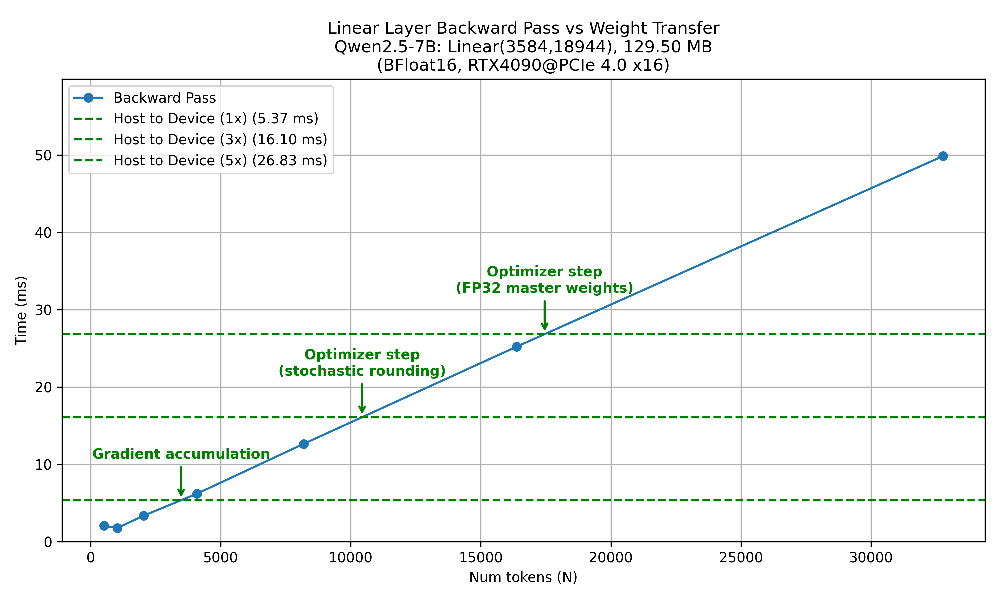

# Offload Adam

Adam optimizer that offloads gradients and optimizer states to CPU memory, enabling full-parameter training of larger models with limited GPU memory.


## Usage

### Adam

```python
from offload_adam import Adam

# Create a model
model = create_model().bfloat16().cuda()

# Initialize the optimizer
optimizer = Adam(
    model.parameters(),
    lr=0.001,
    betas=(0.9, 0.999),
    eps=1e-8,
    weight_decay=0.01,
    mode="stochastic_rounding",
    decoupled_weight_decay=True,  # AdamW
)

# Training loop
for input_data, target in dataloader:
    # Forward pass
    output = model(input_data)
    loss = loss_function(output, target)
    
    # Backward pass
    optimizer.zero_grad()
    loss.backward()
    optimizer.step()
```

### OffloadAdam

```python
from offload_adam import OffloadAdam

# Create a model
model = create_model().bfloat16().cuda()

# Initialize the optimizer
optimizer = OffloadAdam(
    model,  # pass model instead of model.parameters()
    lr=0.001,
    betas=(0.9, 0.999),
    eps=1e-8,
    weight_decay=0.01,
    mode="stochastic_rounding",
    decoupled_weight_decay=True,  # AdamW
)

# Training loop
for input_data, target in dataloader:
    # Forward pass
    output = model(input_data)
    loss = loss_function(output, target)
    
    # Backward pass
    is_gradient_accumulation_step = ...
    optimizer.ready_for_optimizer_step = not is_gradient_accumulation_step
    loss.backward()
    optimizer.step()
```

## How it works

1. Module `register_full_backward_pre_hook`:
    * asynchronously copy states from CPU to GPU

2. Parameter `register_post_accumulate_grad_hook`:
    * gradient accumulation
    * norm calculation for gradient clipping (in OffloadAdam)
    * optimizer step (in OffloadAdamV2)
    * asynchronously copy states back to CPU

Optimizer step is done on GPU.

With offloading, it's possible do full-parameter training of:
* 7B models using single 24GB GPU and 42GB+ host memory
* 14B models using single 48GB GPU and 84GB+ host memory
* 32B models using single 80GB GPU and 192GB+ host memory


## Analysis

The overhead of offloading depends on the input size (total number of tokens in a batch) and GPU compute speed.

### Data transfer costs

gradients, momentum and variance in BF16

| Stage                 | H2D (bytes per param) | D2H (bytes per param) |
|-----------------------|-----------------------|-----------------------|
| gradient reset        | 0                     | 2                     |
| gradient accumulation | 2                     | 2                     |
| optimizer step (stochastic rounding) | 6      | 4                     |
| optimizer step (fp32 master weights) | 10     | 8                     |

### Overlapping data transfer and backward computation

#### 1. nn.Linear

Per-token backward time:

$\frac{4 \times H_{in} \times H_{out}}{TFLOPS \times 10^{12}}$

Weight transfer time:

$\frac{H_{in} \times H_{out} \times 2}{Bandwidth_{GB/s} \times 10^9}$

Number of tokens to overlap weight transfer:

$\frac{H_{in} \times H_{out} \times 2}{Bandwidth_{GB/s} \times 10^9} \div \frac{4 \times H_{in} \times H_{out}}{TFLOPS \times 10^{12}}$

$= \frac{TFLOPS \times 10^{12}}{2 \times Bandwidth_{GB/s} \times 10^9}$

$= \frac{TFLOPS}{2 \times Bandwidth_{GB/s}} \times 1000$


##### RTX4090 case

With theoretical values (165 TFLOPS, 32 GB/s PCIe 4.0):
* ~2578 tokens to overlap gradient transfer

With measured values (175 TFLOPS, 25 GB/s):
* ~3500 tokens to overlap gradient transfer



In actual training, bandwidth will be lower.

### 2. nn.Embedding

Large memory consumption but small computational cost.

Actual involved tokens are usually smaller than the full table:
* For gradient accumulation, only used tokens in the current batch are involved.
* For optimizer step, all ever used tokens are involved because of momentum.

There are optimization chances but not implemented yet.

## TODO

- DTensor support

## References

- [torchao](https://github.com/pytorch/ao)
- [optimi](https://github.com/warner-benjamin/optimi)
